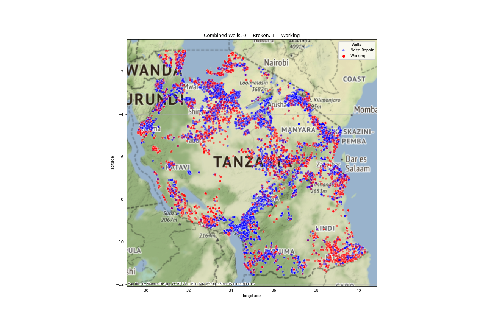

# **Tanzania Ministry of Water** - Water Well Functionality  
### Written by Jun (Andrew) Choi, Dara Estrada, Nicholas Wertz
#### Flatiron School Phase 3 Project  
----

# Table of Contents
#### Overview
#### Business Understanding
#### Data Understanding
#### Modeling
#### Evaluation
#### Conclusion
#### Repository Navigation

---

## Overview
This project was possible thanks to datasets being obtained from DrivenData and Taarifa, a Rwandan news provider. 

The country of Tanzaia is dependent on it's citizens maintaining the ability to access natural sources of drinking water. 
The implications when consuming water from unsafe sources can have fatal consequenses with diarrhea and parasitic diseases causing fatal dehydration
The Tanzaia Ministry of Water needs to combat the possibility of it's citizens dying due to it's countries' lack of improved water sources. Our mission is to correctly identify which wells are functional and which are in need of repair. 

## Business Understanding

The Tanzania Ministry of Water has tasked our team with identifing which wells have been identified as being functional. while also identifying which wells are in need of repair. All of this will be acheived through predictive modeling from basic information we aquired from the dataset about each well.

## Data Understanding

Many of the features included repeating or overlapping information. To eliminate potential issues with our models we created a dataset that contained features we found to be of upmost importance.

## Modeling

 Identifying false positives is so important and is why we decided on precision as our evaluation metric.

## Evaluation

Our final model with an Ensemble Model resulted in 81% accuracy score and 82% precision score.

## Conclusion

From this figure it can be seen that inland, on the southern Tanzanian boarder, there are many wells in need of repair. You can also see few functioning wells in this same area meaning these communities will have to travel farther to get access to drinking water. Regions like these need to be clearly identified in order to be focused on when considering where to begin aid.

### Repo Navigation 
├──[data/](https://bit.ly/3CGlbiD)     <--- Well Data Provided by DrivenData   
├──[images/](https://bit.ly/3JdpAfw)     <--- Images Used For Project   
├──[.gitignore](https://bit.ly/3Jf9D8r)     <--- Git Ignore for Project Repo   
├──[Final Notebook - Jupyter Notebook.pdf](https://bit.ly/3CF0ovO)     <--- PDF of Final Notebook   
├──[Final Notebook.ipynb](https://bit.ly/3q1c5rD)     <--- Final Project Jupyter Notebook  
├──[Presentation.pdf](https://bit.ly/3i2zO6v)     <--- PDF of Project Presentation to the Tanzania Ministy of Water  
├──[README.md](https://bit.ly/3w1luDp)     <--- README.md that you are currently reading  

